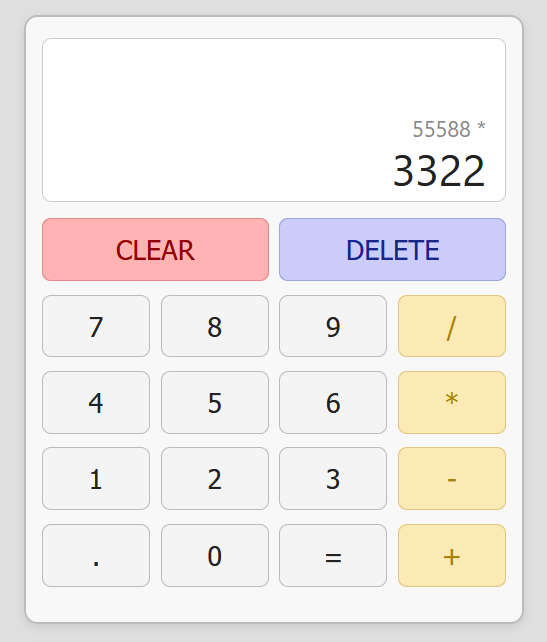

# Modular Calculator

A simple, modular JavaScript calculator built using ES6 modules. Supports basic arithmetic, clear/delete/decimal operations, history tracking, and full mouse + keyboard support.

> **Live demo:** https://kandelakitina.github.io/calculator/

---

## ✨ Features

- Responsive user-friendly interface
- Addition, subtraction, multiplication, and division
- Chainable calculations
- Clear and Delete buttons
- Keyboard input support
- Calculation history display
- Modular code structure for easy maintenance and expansion

---

## 📸 Screenshot



---

## 📦 Project Structure

```
calculator/
├── calculator.js        # Main module (entry point)
├── handlers.js          # Event handlers for buttons & keys
├── state.js             # Calculator state object
├── display.js           # Updates the on-screen display
├── operators.js         # Operator functions and logic
└── keyboard.js          # Keyboard shortcut mapping
index.html               # Demo HTML file
screenshot.png           # This screenshot
```

---

## 🚀 Getting Started

### 1. Clone the repo

```bash
git clone https://github.com/kandelakitina/calculator.git
cd calculator
```

### 2. Open in your browser

Simply open `index.html` in any modern web browser (Chrome, Firefox, Edge, Safari).

No build step or dependencies required.

---

## 🖥️ Usage

- Click calculator buttons with your mouse.
- OR use your keyboard:
  - **Numbers:** `0`-`9`
  - **Operators:** `+`, `-`, `*`, `/`
  - **Decimal:** `.`
  - **Calculate:** `Enter` or `=`
  - **Delete last digit:** `Backspace`
  - **Clear:** `C` or `Escape`

---

## 🛠️ Customise & Extend

- All logic is cleanly divided into ES6 modules.
- To add more operations, modify `calculator/operators.js`.
- UI can be adjusted via HTML and CSS in `index.html` and your stylesheet.

---

## 🕹️ Example Integration

```html
<div class="calculator">
  <div class="display-history"></div>
  <div class="display-answer"></div>
  <!-- Your calculator buttons here -->
</div>
<script type="module" src="./calculator/calculator.js"></script>
```

---

## 📚 License

MIT

---

## 🙋 FAQ

**Q:** What browsers are supported?  
**A:** Any modern browser supporting JavaScript ES6 modules (released after 2018).

**Q:** How do I add new functionality?  
**A:** See `calculator/` modules—extend logic or add new files as needed!

---

## 👩‍💻 Author

[kandelakitina](https://github.com/kandelakitina)

---
